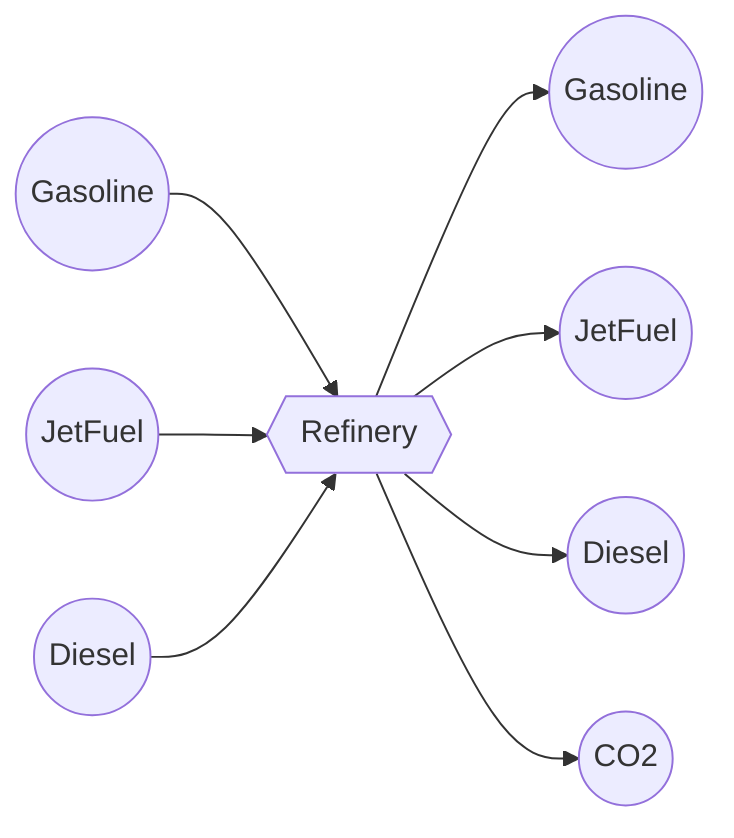

# Constrained Fossil Liquid Fuels

## Overview

`ConstrainedFossilLiquidFuels` represents a refinery that supplies gasoline, jet fuel, and diesel in fixed proportions. It receives one incoming edge for each fuel, passes each stream to its corresponding output, and sends upstream emissions to a CO2 sink.

## Asset Structure



The input and output commodity types are configurable independently. The defaults use `Gasoline`, `JetFuel`, and `Diesel`, so cases using the defaults must define those commodity types. A simple test configuration can instead set every fuel edge's commodity to `LiquidFuels`.

## Flow Equations

```math
\begin{aligned}
f_{gasoline,out} &= f_{gasoline,in} \\
f_{jetfuel,out} &= f_{jetfuel,in} \\
f_{diesel,out} &= f_{diesel,in} \\
f_{jetfuel,in} &= r_{jetfuel} f_{gasoline,in} \\
f_{diesel,in} &= r_{diesel} f_{gasoline,in} \\
f_{CO2} &= e_g f_{gasoline,in} + e_j f_{jetfuel,in} + e_d f_{diesel,in}
\end{aligned}
```

## Input Format

```json
{
  "constrained_fossil_liquid_fuels": [
    {
      "type": "ConstrainedFossilLiquidFuels",
      "instance_data": [
        {
          "id": "refinery_SE",
          "timedata": "LiquidFuels",
          "jetfuel_ratio": 0.5,
          "diesel_ratio": 0.2,
          "gasoline_emission_rate": 0.1,
          "jetfuel_emission_rate": 0.2,
          "diesel_emission_rate": 0.3,
          "fossil_gasoline_start_vertex": "gasoline_supply_SE",
          "fossil_jetfuel_start_vertex": "jetfuel_supply_SE",
          "fossil_diesel_start_vertex": "diesel_supply_SE",
          "gasoline_end_vertex": "gasoline_SE",
          "jetfuel_end_vertex": "jetfuel_SE",
          "diesel_end_vertex": "diesel_SE",
          "co2_sink": "co2_SE"
        }
      ]
    }
  ]
}
```

The three `*_ratio` and three `*_emission_rate` fields are expressed per unit of incoming gasoline, jet fuel, or diesel as shown above. Edge-specific inputs use the prefixes `fossil_gasoline_`, `fossil_jetfuel_`, `fossil_diesel_`, `gasoline_`, `jetfuel_`, `diesel_`, and `co2_`.

## Type Definition

```julia
struct ConstrainedFossilLiquidFuels <: AbstractAsset
    id::AssetId
    refinery_transform::Transformation
    fossil_gasoline_edge::Edge{<:LiquidFuels}
    fossil_jetfuel_edge::Edge{<:LiquidFuels}
    fossil_diesel_edge::Edge{<:LiquidFuels}
    gasoline_edge::Edge{<:LiquidFuels}
    jetfuel_edge::Edge{<:LiquidFuels}
    diesel_edge::Edge{<:LiquidFuels}
    co2_edge::Edge{<:CO2}
end
```
