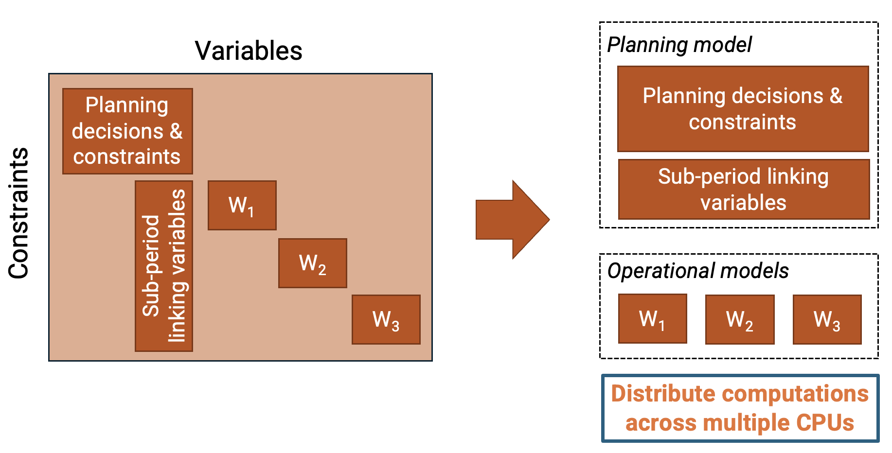

# Running Macro

!!! note "Interactive Notebook"
    The interactive version of this tutorial can be found [here](https://github.com/macroenergy/Macro/tree/main/tutorials/tutorial_2_running_macro.ipynb).

In this tutorial, we start from a single zone electricity system with four resource clusters: utility scale solar PV, land-based wind power generation, natural gas combined cycle power plants, and electricity storage. 

We consider three commodities: electricity, natural gas, and $\text{CO}_2$. 

Initially, hydrogen is modeled exogenously, adding a constant electricity demand for hydrogen production to the electricity demand time series. In other words, we assume the existance of an electrolyzer that continuously consumes electricity to meet the hydrogen demand.

We model a greenfield scenario with a carbon price of 200 USD/ton, i.e., we allow $\text{CO}_2$ emissions with a penalty cost.

**Note: We use the default units in Macro: MWh for energy vectors, metric tons for other commodities (e.g., $\text{CO}_2$) and dollars for costs**

```julia
using Pkg; Pkg.add("VegaLite")
```

```julia
using MacroEnergy
using HiGHS
using CSV
using DataFrames
using JSON3
using VegaLite
```

We first load the inputs:

```julia
system = MacroEnergy.load_system("one_zone_electricity_only");
```

We are now ready to generate the Macro capacity expansion model. Because Macro is designed to be solved by [high performance decomposition algorithms](https://arxiv.org/abs/2403.02559), the model formulation has a specific block structure that can be exploited by these schemes. In the case of 3 operational sub-periods, the block structure looks like this:



```julia
model = MacroEnergy.generate_model(system)
```

Next, we set the optimizer. Note that we are using the open-source LP solver [HiGHS](https://highs.dev/), alternatives include the commerical solvers [Gurobi](https://www.gurobi.com/), [CPLEX](https://www.ibm.com/products/ilog-cplex-optimization-studio), [COPT](https://www.copt.de/).

```julia
MacroEnergy.set_optimizer(model, HiGHS.Optimizer);
```

Finally, we solve the capacity expansion model:

```julia
MacroEnergy.optimize!(model)
```

To output the results in a csv file, we can use the following functions:

```julia
result_dir = joinpath(@__DIR__, "results")
mkpath(result_dir)

write_capacity_results(joinpath(result_dir, "capacity.csv"), system)
write_costs(joinpath(result_dir, "costs.csv"), model)
write_flow_results(joinpath(result_dir, "flow.csv"), system)
```

To only view the results, we can use the following functions:

```julia
get_optimal_capacity(system)
get_optimal_retired_capacity(system)
get_optimal_flows(system)
get_optimal_costs(model)
get_optimal_flows(system)
```

The total system cost (in dollars) is:

```julia
MacroEnergy.objective_value(model)
```

and the total emissions (in metric tonnes) are:

```julia
co2_node = MacroEnergy.get_nodes_sametype(system.locations, CO2)[1]
MacroEnergy.value(sum(co2_node.operation_expr[:emissions]))
```

We can also plot the electricity generation results using `VegaLite.jl`:

```julia
plot_time_interval = 3600:3624
natgas_power = MacroEnergy.value.(MacroEnergy.flow(system.assets[2].elec_edge)).data[plot_time_interval] / 1e3;
solar_power = MacroEnergy.value.(MacroEnergy.flow(system.assets[3].edge)).data[plot_time_interval] / 1e3;
wind_power = MacroEnergy.value.(MacroEnergy.flow(system.assets[4].edge)).data[plot_time_interval] / 1e3;

elec_gen = DataFrame(hours=plot_time_interval,
    solar_photovoltaic=solar_power,
    wind_turbine=wind_power,
    natural_gas_fired_combined_cycle=natgas_power,
)

stack_elec_gen = stack(elec_gen, [:natural_gas_fired_combined_cycle, :wind_turbine, :solar_photovoltaic], variable_name=:resource, value_name=:generation);

elc_plot = stack_elec_gen |>
           @vlplot(
    :area,
    x = {:hours, title = "Hours"},
    y = {:generation, title = "Electricity generation (GWh)", stack = :zero},
    color = {"resource:n", scale = {scheme = :category10}},
    width = 400,
    height = 300
)
```

### Exercise 1
Set a strict net-zero $\text{CO}_2$ cap by removing the slack allowing constraint violation for a penalty. This can be done by deleting the field `price_unmet_policy` from the $\text{CO}_2$ node in file `one_zone_electricity_only/system/nodes.json`

Then, re-run the model with these new inputs and show the capacity results, total system cost, emissions, and plot the generation profiles.

#### Solution

Open file `one_zone_electricity_only/system/nodes.json`, go to the bottom of the file where the $\text{CO}_2$ node is defined. Remove the lines related to the field `price_unmet_policy`, so that the node definition looks like this:

```json
 {
    "type": "CO2",
    "global_data": {
        "time_interval": "CO2"
    },
    "instance_data": [
        {
            "id": "co2_sink",
            "constraints": {
                "CO2CapConstraint": true
            },
            "rhs_policy": {
                "CO2CapConstraint": 0
            }   
        }
    ]
}
```
Then, you need to re-load the inputs:
```julia
system = MacroEnergy.load_system("one_zone_electricity_only");
```
generate the Macro model:
```julia
model = MacroEnergy.generate_model(system);
```
and solve it:
```julia
MacroEnergy.set_optimizer(model, HiGHS.Optimizer);
MacroEnergy.optimize!(model)
```
We can check the results by printing the total system cost:
```julia
MacroEnergy.objective_value(model)
```
and the new emissions (which should be zero):
```julia
co2_node = MacroEnergy.get_nodes_sametype(system.locations, CO2)[1]
MacroEnergy.value(sum(co2_node.operation_expr[:emissions]))
```
Finally, we plot the generation results:
```julia
plot_time_interval = 3600:3624
natgas_power =  MacroEnergy.value.(MacroEnergy.flow(system.assets[2].elec_edge)).data[plot_time_interval]/1e3;
solar_power = MacroEnergy.value.(MacroEnergy.flow(system.assets[3].edge)).data[plot_time_interval]/1e3;
wind_power = MacroEnergy.value.(MacroEnergy.flow(system.assets[4].edge)).data[plot_time_interval]/1e3;

elec_gen =  DataFrame( hours = plot_time_interval, 
                solar_photovoltaic = solar_power,
                wind_turbine = wind_power,
                natural_gas_fired_combined_cycle = natgas_power,
                )

stack_elec_gen = stack(elec_gen, [:natural_gas_fired_combined_cycle,:wind_turbine,:solar_photovoltaic], variable_name=:resource, value_name=:generation);

elc_plot = stack_elec_gen |> 
@vlplot(
    :area,
    x={:hours, title="Hours"},
    y={:generation, title="Electricity generation (GWh)",stack=:zero},
    color={"resource:n", scale={scheme=:category10}},
    width=400,
    height=300
)
```


