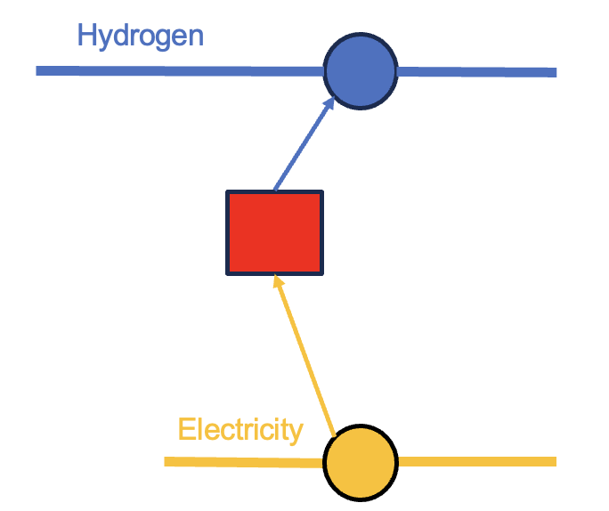
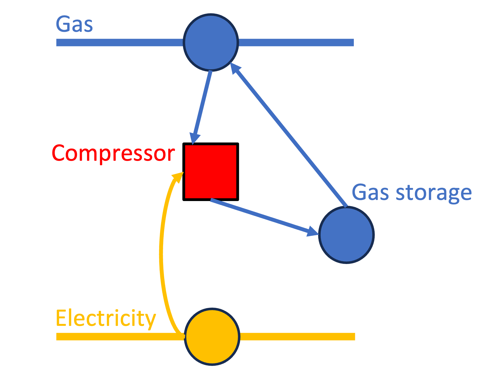
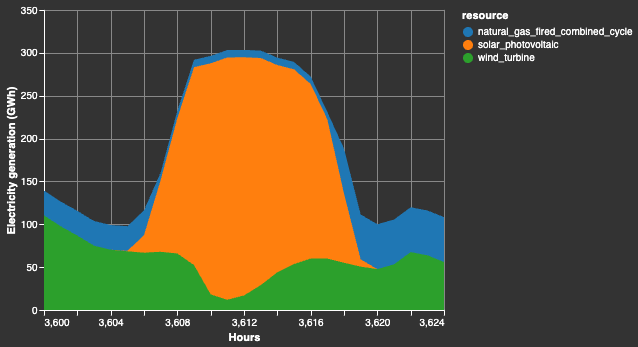
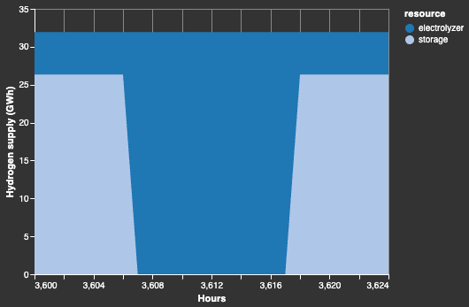

# Multisector modelling with Macro

!!! note "Interactive Notebook"
    The interactive version of this tutorial can be found [here](https://github.com/macroenergy/Macro/tree/main/tutorials/tutorial_3_multisector_modelling.ipynb).

In this tutorial, we extend the electricity-only model considered in Tutorial 2 to build a multisector model for joint capacity expansion in electricity and hydrogen sectors. 

To do this, we scorporate hydrogen and electricity demand from Tutorial 2, and endogeneously model hydrogen production and storage in Macro.

```julia
using Pkg; Pkg.add(["VegaLite", "Plots"])
```

```julia
using Macro
using HiGHS
using CSV
using DataFrames
using JSON3
using Plots
using VegaLite
```

Create a new case folder named "one_zone_multisector"

```julia
if !isdir("one_zone_multisector")
    mkdir("one_zone_multisector")
    cp("one_zone_electricity_only/assets","one_zone_multisector/assets", force=true)
    cp("one_zone_electricity_only/settings","one_zone_multisector/settings", force=true)
    cp("one_zone_electricity_only/system","one_zone_multisector/system", force=true)
    cp("one_zone_electricity_only/system_data.json","one_zone_multisector/system_data.json", force=true)
end
```

**Note:** If you have previously run Tutorial 2, make sure that file `one_zone_multisector/system/nodes.json` is restored to the original version with a $\text{CO}_2$ price. The definition of the $\text{CO}_2$ node should look like this:
```json
{
    "type": "CO2",
    "global_data": {
        "time_interval": "CO2"
    },
    "instance_data": [
        {
            "id": "co2_sink",
            "constraints": {
                "CO2CapConstraint": true
            },
            "rhs_policy": {
                "CO2CapConstraint": 0
            },
            "price_unmet_policy":{
                "CO2CapConstraint": 200
            }    
        }
    ]
}
```

Add Hydrogen to the list of modeled commodities, modifying file `one_zone_multisector/system/commodities.json`:

```julia
new_macro_commodities = Dict("commodities"=> ["Electricity", "NaturalGas", "CO2", "Hydrogen"])

open("one_zone_multisector/system/commodities.json", "w") do io
    JSON3.pretty(io, new_macro_commodities)
end
```

Update file `one_zone_multisector/system/time_data.json` accordingly:

```julia
new_time_data = Dict("PeriodLength"=>8760,
new_time_data = Dict("PeriodLength"=>8760,
                    "HoursPerTimeStep"=>Dict("Electricity"=>1, "NaturalGas"=> 1, "CO2"=> 1, "Hydrogen"=>1),
                    "HoursPerSubperiod"=>Dict("Electricity"=>8760, "NaturalGas"=> 8760, "CO2"=> 8760, "Hydrogen"=>8760)
                )

open("one_zone_multisector/system/time_data.json", "w") do io
    JSON3.pretty(io, new_time_data)
end
```

Move separate electricity and hydrogen demand timeseries into the system folder

```julia
cp("demand_timeseries/electricity_demand.csv","one_zone_multisector/system/demand.csv";force=true)
```

```julia
cp("demand_timeseries/hydrogen_demand.csv","one_zone_multisector/system/hydrogen_demand.csv";force=true)
```

### Exercise 1
using the existing electricity nodes in `one_zone_multisector/system/nodes.json` as template, add an Hydrogen demand node, linking it to the `hydogen_demand.csv` timeseries.

#### Solution

The definition of the new Hydrogen node in `one_zone_multisector/system/nodes.json` should look like this:

```json
    {
        "type": "Hydrogen",
        "global_data": {
            "time_interval": "Hydrogen",
            "constraints": {
                "BalanceConstraint": true
            }
        },
        "instance_data": [
            {
                "id": "h2_SE",
                "demand": {
                    "timeseries": {
                        "path": "system/hydrogen_demand.csv",
                        "header": "Demand_H2_z1"
                    }
                }
            }
        ]
    },
```

Next, add an electrolyzer asset represented in Macro as a transformation connecting electricity and hydrogen nodes:



To include the electrolyzer, create a file `one_zone_multisector/assets/electrolyzer.json` based on the asset definition in `src/model/assets/electrolyzer.jl`:

```json
{
   "electrolyzer": [
        {   
            "type": "Electrolyzer",
            "global_data":{
                "transforms": {
                    "timedata": "Electricity",
                    "constraints": {
                        "BalanceConstraint": true
                    }
                },
                "edges": {
                    "h2_edge": {
                        "type": "Hydrogen",
                        "unidirectional": true,
                        "has_capacity": true,
                        "can_retire": true,
                        "can_expand": true,
                        "constraints": {
                            "CapacityConstraint": true,
                            "RampingLimitConstraint": true,
                            "MinFlowConstraint": true
                        }
                    },
                    "elec_edge": {
                        "type": "Electricity",
                        "unidirectional": true,
                        "has_capacity": false
                    }
                }
            },
            "instance_data":[
                {
                    "id": "SE_Electrolyzer",
                    "transforms":{
                        "efficiency_rate": 0.875111139 // units: # MWh of H2 / MWh of electricity
                    },
                    "edges":{
                        "elec_edge": {
                            "start_vertex": "elec_SE"
                        },
                        "h2_edge": {
                            "end_vertex": "h2_SE",
                            "existing_capacity": 0,
                            "investment_cost": 41112.53426,
                            "fixed_om_cost": 1052.480877,
                            "variable_om_cost": 0.0,
                            "capacity_size": 1.5752,
                            "ramp_up_fraction": 1,
                            "ramp_down_fraction": 1,
                            "min_flow_fraction":0.1
                        }
                    }
                }
            ]
        }
    ]
}
```

Include an hydrogen storage resource cluster, represented in Macro as combination of a compressor transformation (consuming electricity to compress the gas) and a storage node:



Add a file `one_zone_multisector/assets/h2_storage.json` based on the asset definition in  `src/model/assets/gasstorage.jl`that should look like this:

```json
{
    "h2stor": [
        {
            "type": "GasStorage",
            "global_data": {
                "nodes": {},
                "transforms": {
                    "timedata": "Hydrogen",
                    "constraints": {
                        "BalanceConstraint": true
                    }
                },
                "edges": {
                    "discharge_edge": {
                        "type": "Hydrogen",
                        "unidirectional": true,
                        "can_expand": true,
                        "can_retire": false,
                        "has_capacity": true,
                        "constraints": {
                            "CapacityConstraint": true,
                            "RampingLimitConstraint": true
                        }
                    },
                    "charge_edge": {
                        "type": "Hydrogen",
                        "unidirectional": true,
                        "has_capacity": true,
                        "can_expand": true,
                        "can_retire": false,
                        "constraints": {
                            "CapacityConstraint": true
                        }
                    },
                    "compressor_elec_edge": {
                        "type": "Electricity",
                        "unidirectional": true,
                        "has_capacity": false
                    },
                    "compressor_gas_edge": {
                        "type": "Hydrogen",
                        "unidirectional": true,
                        "has_capacity": false
                    }
                },
                "storage": {
                    "commodity": "Hydrogen",
                    "can_expand": true,
                    "can_retire": false,
                    "constraints": {
                        "StorageCapacityConstraint": true,
                        "BalanceConstraint": true,
                        "MinStorageLevelConstraint": true
                    }
                }
            },
            "instance_data": [
                {
                    "id": "SE_Above_ground_storage",
                    "transforms": {
                        "electricity_consumption": 0.018029457
                    },
                    "edges": {
                        "discharge_edge": {
                            "end_vertex": "h2_SE",
                            "existing_capacity": 0,
                            "investment_cost": 0.0,
                            "fixed_om_cost": 0.0,
                            "variable_om_cost": 0.0,
                            "efficiency": 1.0,
                            "ramp_up_fraction": 1,
                            "ramp_down_fraction": 1
                        },
                        "charge_edge":{
                            "existing_capacity": 0,
                            "investment_cost": 3219.236569,
                            "fixed_om_cost": 0.0,
                            "variable_om_cost": 0.0,
                            "efficiency": 1.0
                        },
                        "compressor_gas_edge": {
                            "start_vertex": "h2_SE"
                        },
                        "compressor_elec_edge": {
                            "start_vertex": "elec_SE"
                        }
                    },
                    "storage":{
                        "investment_cost_storage": 873.013307,
                        "fixed_om_cost_storage":28.75810056,
                        "storage_loss_fraction": 0.0,
                        "min_storage_level": 0.3
                    }
                }
            ]
        }
    ]
}
```

### Exercise 2
Following the same steps taken in Tutorial 2, load the input files, generate Macro model, and solve it using the open-source solver HiGHS.

#### Solution

First, load the inputs:
```julia
system = MacroEnergy.load_system("one_zone_multisector");
```
Then, generate the model:
```julia
model = MacroEnergy.generate_model(system)
```

Finally, solve it using the HiGHS solver:
```julia
MacroEnergy.set_optimizer(model, HiGHS.Optimizer);
MacroEnergy.optimize!(model)
```

### Exercise 3
As in Tutorial 2, print optimized capacity for each asset, the system total cost, and the total emissions. 

What do you observe?

To explain the results, plot both the electricity generation and hydrogen supply results as done in Tutorial 2 using `VegaLite.jl`.

#### Solution

Optimized capacities are retrieved as follows:

```julia
capacity_results = MacroEnergy.get_optimal_asset_capacity(system)
```
Total system cost is:
```julia
MacroEnergy.objective_value(model)
```

Total $\text{CO}_2$ emissions are:
```julia
co2_node = MacroEnergy.get_nodes_sametype(system.locations, CO2)[1]
MacroEnergy.value(sum(co2_node.operation_expr[:emissions]))
```

Note that we have achieved lower costs and emissions when able to co-optimize capacity and operation of electricity and hydrogen sectors. In the following, we further investigate these

```julia
plot_time_interval = 3600:3624
```
Here is the electricity generation profile:
```julia
natgas_power =  MacroEnergy.value.(MacroEnergy.flow(system.assets[4].elec_edge)).data[plot_time_interval]/1e3;
solar_power = MacroEnergy.value.(MacroEnergy.flow(system.assets[5].edge)).data[plot_time_interval]/1e3;
wind_power = MacroEnergy.value.(MacroEnergy.flow(system.assets[6].edge)).data[plot_time_interval]/1e3;

elec_gen =  DataFrame( hours = plot_time_interval, 
                solar_photovoltaic = solar_power,
                wind_turbine = wind_power,
                natural_gas_fired_combined_cycle = natgas_power,
                )

stack_elec_gen = stack(elec_gen, [:natural_gas_fired_combined_cycle,:wind_turbine,:solar_photovoltaic], variable_name=:resource, value_name=:generation);

elc_plot = stack_elec_gen |> 
@vlplot(
    :area,
    x={:hours, title="Hours"},
    y={:generation, title="Electricity generation (GWh)",stack=:zero},
    color={"resource:n", scale={scheme=:category10}},
    width=400,
    height=300
)
```


During the day, when solar photovoltaic is available, almost all of the electricity generation comes from VREs.

Because hydrogen storage is cheaper than batteries, we expect the system to use the electricity generated during the day to operate the electrolyzers to meet the hydrogen demand, storing the excess hydrogen to be used when solar photolvoltaics can not generate electricity.

We verify our assumption by making a stacked area plot of the hydrogen supply (hydrogen generation net of the hydrogen stored):

```julia
electrolyzer_idx = findfirst(isa.(system.assets,Electrolyzer).==1)
h2stor_idx = findfirst(isa.(system.assets,GasStorage{Hydrogen}).==1)

electrolyzer_gen =  MacroEnergy.value.(MacroEnergy.flow(system.assets[electrolyzer_idx].h2_edge)).data[plot_time_interval]/1e3;
h2stor_charge =  MacroEnergy.value.(MacroEnergy.flow(system.assets[h2stor_idx].charge_edge)).data[plot_time_interval]/1e3;
h2stor_discharge = MacroEnergy.value.(MacroEnergy.flow(system.assets[h2stor_idx].discharge_edge)).data[plot_time_interval]/1e3;

h2_gen = DataFrame( hours = plot_time_interval, 
                    electrolyzer = electrolyzer_gen - h2stor_charge,
                    storage =  h2stor_discharge)

stack_h2_gen = stack(h2_gen, [:electrolyzer, :storage], variable_name=:resource, value_name=:supply);

h2plot = stack_h2_gen |> 
    @vlplot(
        :area,
        x={:hours, title="Hours"},
        y={:supply, title="Hydrogen supply (GWh)",stack=:zero},
        color={"resource:n", scale={scheme=:category20}},
        width=400,
        height=300
    )
```


