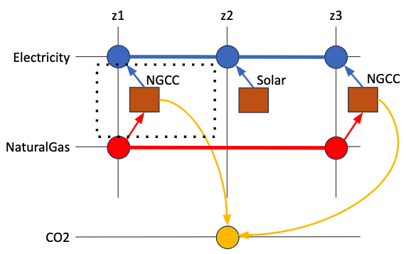

# User Guide

## Introduction: Energy System in Macro

The Macro model is designed to represent the energy system in a detailed manner, with various sectors and technologies interacting. Each sector is characterized by a **commodity**, a type of energy carrier. The current model includes the following sectors:

- Electricity
- Natural Gas
- CO2 and CO2 Capture
- Hydrogen
- Coal
- Biomass
- Uranium

The energy system is modeled as a *multi-plex network* — a multi-layered network that connects different sectors.

The key components of this network are:

- **Nodes**: Represent geographical locations or zones, each associated with a commodity type. They form the network for a specific sector (e.g., electricity network, hydrogen network, etc.).
- **Transformations**: Special nodes that convert one commodity type into another, acting as bridges between sectors.
- **Edges**: Represent the flow of commodities between nodes and transformations.
- **Storage** Units: Store commodities for future use.

The figure below illustrates a multi-plex network representing an energy system with electricity, natural gas, and CO2 sectors, with two natural gas power plants, and a solar panel. Blue nodes represent the electricity sector, red nodes represent natural gas, and yellow nodes represent CO2. The edges depict commodity flow, and squares represent transformation points.

