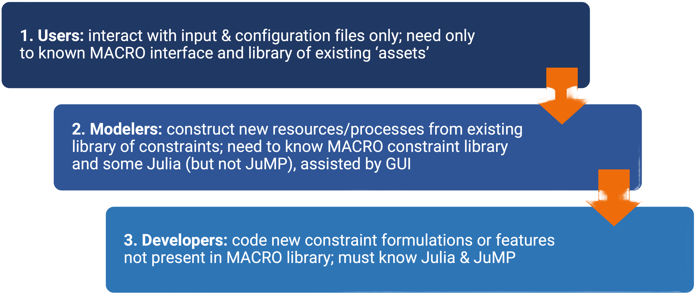

```@meta
CurrentModule = MacroEnergy
```

# Macro

**Welcome to the [Macro](https://github.com/macroenergy/MacroEnergy.jl.git) documentation!**

**This documentation is a work-in-progress, so please forgive our appearance as we add material.**

**All feedback is welcome and please report and errors or omissions through [the MacroEnergy.jl issues page.](https://github.com/macroenergy/MacroEnergy.jl/issues)**

## What is Macro?

**Macro** is a bottom-up, multi-sectoral infrastructure optimization model for macro-energy systems. It co-optimizes the design and operation of user-defined models of multi-sector energy systems and networks. Macro allows users to explore the impact of energy policies, technology costs and performance, demand patterns, and other factors on an energy system as a whole and as separate sectors.

The main features of Macro include:

- **Graph-based representation** of the energy system, facilitating clear representation and analysis of energy and mass flows between sectors.
- **"Plug and play" flexibility** for integrating new technologies and sectors, including electricity, hydrogen, heat, and transport.
- **High spatial and temporal resolution** to accurately capture sector dynamics.
- Designed for **distributed computing** to enable large-scale optimizations.
- Tailored **Benders decomposition** framework for optimization.
- **Open-source** built using Julia and JuMP.

## Structure of the documentation

The documentation contains five main sections:

- **[Getting Started](@ref)**: How to install Macro and run your first cases

- **[Tutorials](@ref)**: Long-form guides with worked examples, intended to help you learn how to use Macro

- **[Guides](@ref)**: Short guides which walk you through how to achieve specific tasks, intended to be a day-to-day reference when working with Macro

- **[Manual](@ref)**: A detailed description of Macro's components and features

- **[Reference](@ref "References")**: A function reference for Macro's API

## Recent changes

<!-- BEGIN GENERATED RECENT CHANGES -->
### 0.2.5 - 2026-09-14
#### Fixed

- `StorageChargeLimitConstraint` is now attached to a `Battery`'s charge edge. Before, it was declared as a top-level key in the charge edge's default data instead of inside its `constraints` dictionary, so it was silently dropped.

#### Migration guide

- **Results change:** no public API changed, but any case using a `Battery` asset could now produce different results. The charge limit (`charge_flow[t] <= capacity - storage_level[t-1]`, scaled by the charge efficiency) was previously not included by default and is now enforced. To keep the old behavior, disable it explicitly on the charge edge: `"charge_edge": {"constraints": {"StorageChargeLimitConstraint": false}}`.
- If you set `StorageChargeLimitConstraint` as a top-level key on a charge edge, rather than inside that edge's `constraints` dictionary, it was and still is ignored. Move it inside `constraints` for it to take effect.
- `StorageChargeLimitConstraint` only applies to an edge whose end vertex is the storage, i.e. the charge edge. Setting it on the discharge edge (or via `discharge_constraints` in the simple input format) has no effect.

For the full release history, see [the changelog](@ref Changelog).
<!-- END GENERATED RECENT CHANGES -->

## Macro development strategy

Macro is a very flexible tool for modelling energy systems. However, that flexibility also means the core architecture and functions are complex and difficult to use correctly.

To make Macro as useful and accessible to the widest audience possible we designed and developed it with three layers of abstractions in mind, each serving a different user profile:



Due to these abstractions, users and modelers will be able to achieve their goals without needing to understand every aspect of Macro. The [guides section](@ref "Guides") of the documentation has guides for users, modelers, and developers.
