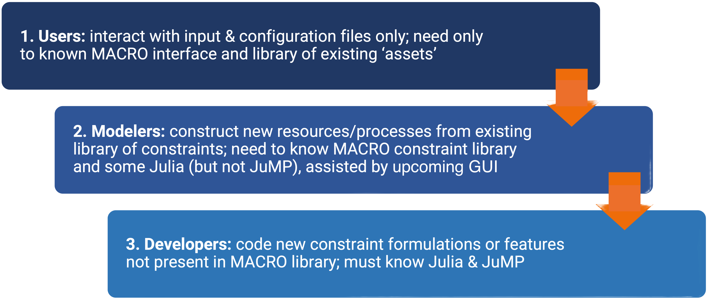

```@meta
CurrentModule = MacroEnergy
```

# Macro

### Welcome to the [Macro](https://github.com/macroenergy/MacroEnergy.jl.git) documentation!

## What is Macro?

**Macro** is a bottom-up, electricity-centric, macro-energy systems optimization model. It is designed to capture capacity investments, operations, and energy flows across and between multiple energy sectors and can therefore be used to explore the impacts of different energy policies, technology costs, and other exogenous factors on the energy system. 

The main features of Macro include:
- Tailored **Benders decomposition** framework for optimization.
- **Graph-based representation** of the energy system, including demand nodes, edges, storage units, and transformation nodes (representing conversion processes between sectors).
- **"Plug and play" flexibility** for integrating various technologies and sectors (e.g., electricity, hydrogen, heat, and transport).
- **Granular spatial and temporal resolution** to accurately capture sector dynamics.
- Designed for **distributed computing** to enable large-scale optimizations.
- **Open-source** built using Julia and JuMP.

## Macro development strategy

Macro has been designed and developed with three layers of abstractions in mind, each serving a different type of user:



The following sections of the documentation are designed to serve the different needs of the different users.

## Package Outline

- ##### [Getting Started](@ref)
- ##### [User Guide](@ref)
- ##### [Modeler Guide](@ref)
- ##### [Developer Guide](@ref)

## [Table of contents](@ref)